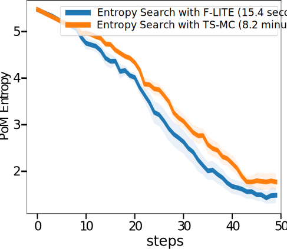
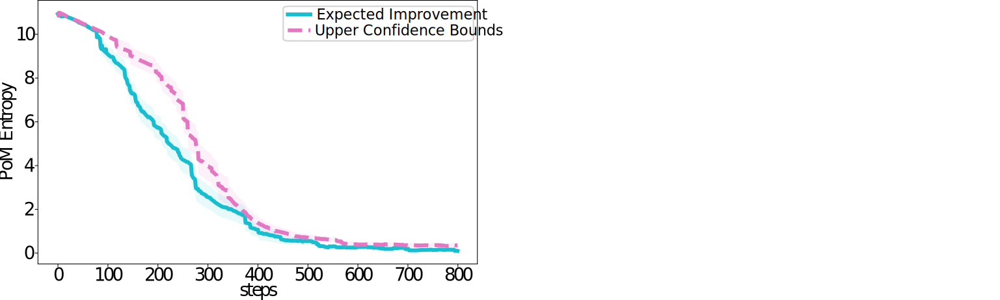
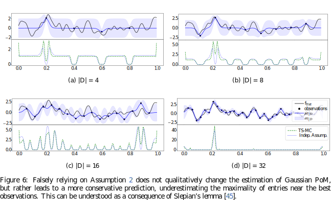

# Introduction

This is the official codebase for LITE: Efficiently Estimating Gaussian Probability of Maximality, a paper submitted to AI-STATS 2025. The following files and subdirectories are present in this directory:

- code
    - src
        - divergences.py
        - gaussians.py
        - hyperopt.py
        - kernels.py
        - poo_estimators_and_BO.py
        - quadrotor.py
        - test_functions.py
    - requirements.txt
    - entropy_estimation_with_E-TSE_combiner.py
    - entropy_estimation_with_E-TSE.py
    - poo_accuracy_during_sampling_combiner.py
    - poo_accuracy_during_sampling.py
    - poo_accuracy_for_independent_gp_combiner.py
    - poo_accuracy_for_independent_gp.py
    - regret_experiment_combiner.py
    - regret_experiment.py
    - test_function_accuracy_vs_compute.py
    - test_function_entropy_rmsre_over_time.py
    - test_function_poo_during_sampling.py
    - test_function_posterior_during_sampling.py
    - test_function_recall.py
    - test_function_runtime_per_domain_size.py
    - test_function_visualise_posterior.py
    - visualise_distribution_of_iid_gaussians.py
    - visualise_independence_estimator.py
    - visualise_least_number_of_Thompson_samples.py
- README.md

The outermost scripts are intended to be called from this directory and provide a manual, e.g.

> python code/visualise_distribution_of_iid_gaussians.py -h

They set up the various experiments conducted for the development of the associated paper and combine their respective results. A practitioner that wants to use LITE in their codebase only needs the files src/poo_estimators_and_BO.py, src/gaussians.py, and src/kernels. Indeed, only the methods nie_poo, cme_poo, and vapor_poo in src/poo_estimators_and_BO.py and their few dependencies are essential for running LITE and F-VAPOR, the other functions are adaptions thereof and alternative ideas that did not make it into the paper. We still provide them at the user's discretion. 

# Digging into the code
Compared to the paper version, there are some differences in the nomenclature of the PoM estimators.
TS-MC                   <-> E-TSE (Exhaustive Thompson Sampling Estimator)
Independence Assumption <-> IE (Independence Estimator)
A-LITE                  <-> NIE (Normal Independence Estimator)
F-LITE                  <-> CME (Concentrated Maximum Estimator)
EST                     <-> NEST (Normalised EST)
Also, whereas the code speaks of probability of optimality (POO), the paper called the same concept probability of maximality (PoM).
When going through the code, it will become apparent that we have explored much more estimators and procedures than indicated in the paper submission. The practicioner is advised to cherry-pick the estimation methods that they find most useful. However, A-LITE, F-LITE, and F-VAPOR, the methods emphasised in the paper, can be run by calling the following functions in src/poo_estimators_and_BO.py:

- nie_poo(gaussian_means:jax.Array, gaussian_stds:jax.Array, alpha:float, simplified=False)
- cme_poo(gaussian_means:jax.Array, gaussian_stds:jax.Array, alpha:float, scaling:float=1.0)
- vapor_poo(gaussian_means:jax.Array, gaussian_stds:jax.Array, alpha:float)

Here, alpha describes the relative convergence of the algorithms to their analytical expressions (elementwise precision of estimates at 1 / (alpha |X|)). In practice, alpha = 100 ensures good convergence in our experience. The scaling factor can be used to adapt the prudence of the estimator by globally rescaling the uncertainty in the form of the standard deviation of the Gaussian vector. If simplified is set to true for NIE/A-LITE, only A-LITE I is used. This runs slightly more quickly by avoiding the nested quartile fitting, but is less accurate.

# Install requirements

The project is based on Python 3.11.6. Create a virtual python environment using

> python -m venv .venv

Activate the environment with

> source .venv/bin/activate

Finally, install the requirements with

> python -m pip install -r code/requirements.txt

To be able to log and visualise the results we use [Weights & Biases](wandb.ai). After creating an account on their website, log in with

> wandb login

before running the scripts

# Reproducing Results
In the following we provide the commands to reproduce our results assuming they are executed from the main directory. Depending on the settings one may need GPU support and sufficient time to reproduce our results, the baseline TS-MC runs really slowly (which is what motivated the development of LITE in the first place).

## 1-dim GP and 2-dim GP experiment
Plots the TV distance and Sinkhorn distance to the groundtruth during Bayesian optimisation based on Thompson Sampling

> python code/poo_accuracy_during_sampling.py -s=$seed -no=200

> python code/poo_accuracy_during_sampling.py -s=$seed -c=400 -no=50 --two_d_domain -k=laplacian -l=0.1

In order to combine the results of several regret experiments into one plot, use 

> python code/poo_accuracy_during_sampling_combiner.py file1.npz file2.npz ...

## Synthetic Distributions experiment

Plots the TV distance between IE and CME (as well as its competitors) as the domain size increases. We use the settings:
--std_range=10 --mean_range=5
--std_range=2 --mean_range=5
--std_range=0.5 --mean_range=5
--std_range=0.5 --mean_range=0.1

for the script

> python code/poo_accuracy_for_independent_gp.py -s=?

where we run s from 0 to 19 (for 20 repetitions). In order to combine the results of several regret experiments into one plot, use 

> python code/poo_accuracy_for_independent_gp_combiner.py file1.npz file2.npz ...

## DropWave and Quadcopter
To analyze the PoM estimation for Bayesian Optimization of fixed test functions such as those provided by DropWave and Quadrotor, one can first run Bayesian optimisation with Expected Improvement to obtain the Gaussian posteriors at intermediate time steps:

> python code/test_function_posterior_during_sampling.py drop-wave-mini -rcc -s=0 -t --mlm_n_random_observations=10 --n_observations=30

Further information on the individual settings, including for marginal likelihood maximisation, can be obtained by querying the help manual from the program. Once one has stored the posteriors, one can run the following script to derive the associated PoM estimates according to the various considered PoM estimators:

> python code/test_function_poo_during_sampling.py

With the PoMs (POOs) savely stored, we can examine various metrics to compare the relative performance of different PoM estimators. To that end, we provide the following programs (each with their own -h manual)

> python code/test_function_accuracy_vs_compute.py

> python code/test_function_entropy_rmsre_over_time.py

> python code/test_function_recall.py

> python code/test_function_runtime_per_domain_size.py

> python code/test_function_visualise_posterior.py

## Appendix, illustrate the number of samples necessary for accurate TS-MC

We evaluate the exhaustive Thompson sampling estimator (E-TSE) for a different number of samples $\alpha^2 | \mathcal X |^2$ where we vary $\alpha$ in (5.0, 1.0, 0.2, 0.04). To give a more complete picture, and compare against CME, we repeat the process for two different kernels (gaussian, laplacian)

> python code/visualise_least_number_of_Thompson_samples.py -c 2500 --two_d_domain --kernel=gaussian --alpha=5.0

> python code/visualise_least_number_of_Thompson_samples.py -c 2500 --two_d_domain --kernel=laplacian --alpha=5.0

> python code/visualise_least_number_of_Thompson_samples.py -c 2500 --two_d_domain --kernel=gaussian --alpha=1.0

> python code/visualise_least_number_of_Thompson_samples.py -c 2500 --two_d_domain --kernel=laplacian --alpha=1.0

> python code/visualise_least_number_of_Thompson_samples.py -c 2500 --two_d_domain --kernel=gaussian --alpha=0.2

> python code/visualise_least_number_of_Thompson_samples.py -c 2500 --two_d_domain --kernel=laplacian --alpha=0.2

> python code/visualise_least_number_of_Thompson_samples.py -c 2500 --two_d_domain --kernel=gaussian --alpha=0.04

> python code/visualise_least_number_of_Thompson_samples.py -c 2500 --two_d_domain --kernel=laplacian --alpha=0.04

## Appendix, illustrate the distribution of the maximum of standard normals
To illustrate the distribution of the maximum of standard normals run the following two commands:

> python code/visualise_distribution_of_iid_gaussians.py

> python code/visualise_distribution_of_iid_gaussians.py --n_density 250 --domain_density 1000000 --mean_std

The domain density is increased to reduce errors in the numerical estimation of first and second moments, see the bump at around $n=10^{15}$.

## Appendix, Impact of the Independence Assumption
In order to understand the impact of falsely dropping all correlation structure, run the following commands. You will obtain a comparison between TS-MC and estimation with Independence Assumption for various settings. Notice that qualitatively, the estimation remains truthful despite neglecting correlation information.

Boundary Discrepancies

> python code/visualise_independence_estimator.py -c 200 --kernel=gaussian --length_scale 0.02

> python code/visualise_independence_estimator.py -c 200 --kernel=laplacian --length_scale 0.02

> python code/visualise_independence_estimator.py -c 200 --kernel=laplacian --length_scale 0.005

> python code/visualise_independence_estimator.py -c 50 --kernel=gaussian --length_scale 0.02

Domain size

> python code/visualise_independence_estimator.py -c 100 --kernel=gaussian --length_scale 0.04 --number_of_observation_points=2

> python code/visualise_independence_estimator.py -c 200 --kernel=gaussian --length_scale 0.02 --number_of_observation_points=4

> python code/visualise_independence_estimator.py -c 400 --kernel=gaussian --length_scale 0.01 --number_of_observation_points=8

> python code/visualise_independence_estimator.py -c 800 --kernel=gaussian --length_scale 0.005 --number_of_observation_points=16

Uniformity of the posterior

> python code/visualise_independence_estimator.py -c 200 --kernel=gaussian --length_scale 0.02 --number_of_observation_points=2

> python code/visualise_independence_estimator.py -c 200 --kernel=gaussian --length_scale 0.02 --number_of_observation_points=4

> python code/visualise_independence_estimator.py -c 200 --kernel=gaussian --length_scale 0.02 --number_of_observation_points=8

> python code/visualise_independence_estimator.py -c 200 --kernel=gaussian --length_scale 0.02 --number_of_observation_points=16

## EntropySearch Regret Experiments
In order to compare Entropy Search using TS-MC and Entropy Search using F-LITE, run the following commands:

> python code/regret_experiment.py CES -c=250 -o=50 -n=0.2 -r=10 --timeit

> python code/regret_experiment.py ES -c=250 -o=50 -n=0.2 -r=10 --timeit

Here, CES refers to using F-LITE and ES refers to using TS-MC. In order to combine the results of the two experiments into one plot, use 

> python code/regret_experiment_combiner.py file1.npz file2.npz ...

## 1k-dim linear kernel experiment
For the large scale experiment, a lot of storage, RAM, and compute are necessary. Run the following commands to generate posteriors from 800 steps of Bayesian optimization (based on EI and UCB) on a domain of 10k elements in 1k dimensions:

> python code/test_function_posterior_during_sampling.py random_linear -a=EI -s=$i -t -k=linear -no=800 --max_n_observations_for_mlm=150

> python code/test_function_posterior_during_sampling.py random_linear -a=UCB -s=$i -t -k=linear -no=800 --max_n_observations_for_mlm=150

Next, process these posteriors by running PoM estimation on them. Here, running the Independence Assumption (IE) would incur a runtime of 500 hours on an A100 GPU, so we will only run F-LITE (CME).

> python code/test_function_poo_during_sampling.py FILENAME CME --alpha=100

# Rebuttal additional results

For the rebuttal, we have added the following additional results, which will be incorporated into the camera-ready version of the paper.

## Accelerating Entropy Search

We sample a Gaussian process on the line segment $[0,1]$ with a Gaussian kernel (length scale $0.02$, amplitude $1.0$). We assume an observation model with independent homoscedastic centered Gaussian noise with $\sigma_{noise} = 0.2$. We run calibrated Entropy Search for $50$ steps after evenly discretising the domain to $|\mathcal X|=250$ points. The experiment is repeated $10$ times and we report on the mean and standard error of the entropy of PoM, which is the objective that Entropy Search seeks to minimise. We also show an example posterior and its corresponding acquisition function after $20$ steps. The entropy search objective uses five samples to condition on hypothetical observations. For each conditioning, the PoM entropy reduction is estimated either with F-LITE for convergence parameter $\epsilon = 1/(10 | \mathcal X |)$, or using TS-MC. Running TS-MC to convergence would lead to an exploding runtime, so we always only use a fixed budget of 4 samples (notice that Entropy Search requires repeated PoM estimation conditioning on hallucinated observations at each $x \in \mathcal X$ and as such is even more expensive than just a single run of TS-MC). Note that we cannot decrease the cost much further, since for a single Monte Carlo sample the entropy would always degenerate to 0. Even so, on an NVIDIA TITAN RTX GPU a full run of Entropy search using LITE takes just 15.4 seconds, whereas using the TS-MC backend, it takes 8.2 minutes. This difference becomes much more pronounced as the size of the Gaussian reward vector is increased. We have thus increased the scalability of Entropy search significantly by formulating a linear-time algorithm for estimating Gaussian PoM.

## 1k-dim linear kernel experiment

To demonstrate that LITE can truly be scaled to large-scale industrial settings, we run an additional experiment where the ground-truth objective function is described by a hyperplane in 1k dimensions, sampled at 10k points on the unit-sphere. Such a setting matches well our motivation in the introduction: in drug-design one often uses (graph) neural networks to compute high-dimensional embeddings of molecule descriptions before running Bayesian optimization with a linear kernel. A comparison between LITE and a ground-truth surrogate for PoM is here not possible: even estimation under the Independence Assumption would require 500 hours on an NVIDIA A100 GPU to compute PoMs across the BO-path for one seed. In contrast, LITE only takes a few seconds (~30 seconds). In practice, LITE can thus be used to better understand the state of the Bayesian optimization procedure, or even to compare different Bayesian optimisation strategies by empirically contrasting their PoM entropy reduction.

## Visualisation of Bias from Independence Assumption

We have added the following figure to the Appendix:

Its accompanying text reads as follows:

Let us develop some intuition on the estimation bias introduced by falsely assuming uncorrelated entries in the Gaussian reward vector (Assumption 2). To that end, we consider some examples of discretized Gaussian processes that violate the independence assumption. 

Figure-X considers posteriors with varying degree of concentration of measure, covering different stages of Bayesian optimization. The figure demonstrates that PoM estimation based on Assumption 2 qualitatively captures the ground-truth PoM (here estimated using TS-MC). The degeneracies at the border of the ground-truth PoM correspond to dirac-deltas of the probability density function of PoM, but have small effective measure and as such are of little concern.

Theoretically, the dominant effect of falsely assuming independence can be understood by considering Slepian's lemma, which implies that if $F \sim \mathcal N (\mu, \Sigma)$ and $\tilde F \sim \mathcal N(\mu, \mathrm{diag}(\Sigma))$ it holds $\forall t \in \mathbb R$ that
$$
    \mathbb P[F^* > t] \leq \mathbb P[\tilde F^* > t] \implies \mathbb E[F^*] \leq \mathbb E[\tilde F^*].
$$
In light of this, the minor differences that can be observed in Figure-X between the PoM under Assumption 2 and the ground-truth PoM are explained as follows: Assumption 2 leads to over-estimating the maximum reward $F^*$ (Slepian's lemma), which results in overly-cauteous estimation of PoM, in particular under-estimating regions associated with promising observations. However, we stress that despite this bias towards caution, estimation under the Independence Assumption still manages to qualitatively capture the ground-truth PoM.

The experimental details of Figure-X are as follows: the domain consists of $|\mathcal X| = 200$ equidistant points on which $f_{true}$, a sample from a centered Gaussian process $\mathcal{GP}$ with squared exponential kernel (length scale $0.02$, amplitude $1.0$), is evaluated. The prior belief over $f_{true}$ coincides with $\mathcal{GP}$ except for the doubling of the amplitude to $2.0$. $f_{true}$ is observed at $|\mathcal D|$ regularly selected locations with homoscedastic additive centered Gaussian noise ($\sigma_{noise} = 0.5$). We set the accuracy parameter to $\epsilon = 1/({5 | \mathcal X|})$. The estimated probability mass functions (of PoM) are rescaled by $1/|\mathcal X|$ to simulate a probability density function.