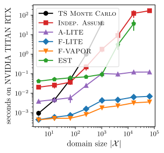

# LITE: Efficiently Estimating Gaussian Probability of Maximality

### Nicolas Menet, Jonas Hübotter, Parnian Kassraie, Andreas Krause

AISTATS 2025



This repository contains the implementations of LITE as well as the experimental setup for the paper. The majority of the code base, including the scripts for running the experiments, can be found in the `code` directory. For convenience, we additionally provide self-contained code for the fast variant of LITE in `flite.py`.

## Citation
If you use the work released here for your research, please cite our paper:
```
@article{??
}
```

## License
```
Copyright (c) 2025 Nicolas Menet, Jonas Hübotter, Parnian Kassraie, Andreas Krause

Permission is hereby granted, free of charge, to any person obtaining a copy of this software and associated documentation files (the "Software"), to deal in the Software without restriction, including without limitation the rights to use, copy, modify, merge, publish, distribute, sublicense, and/or sell copies of the Software, and to permit persons to whom the Software is furnished to do so, subject to the following conditions:

The above copyright notice and this permission notice shall be included in all copies or substantial portions of the Software.

THE SOFTWARE IS PROVIDED "AS IS", WITHOUT WARRANTY OF ANY KIND, EXPRESS OR IMPLIED, INCLUDING BUT NOT LIMITED TO THE WARRANTIES OF MERCHANTABILITY, FITNESS FOR A PARTICULAR PURPOSE AND NONINFRINGEMENT. IN NO EVENT SHALL THE AUTHORS OR COPYRIGHT HOLDERS BE LIABLE FOR ANY CLAIM, DAMAGES OR OTHER LIABILITY, WHETHER IN AN ACTION OF CONTRACT, TORT OR OTHERWISE, ARISING FROM, OUT OF OR IN CONNECTION WITH THE SOFTWARE OR THE USE OR OTHER DEALINGS IN THE SOFTWARE.
```